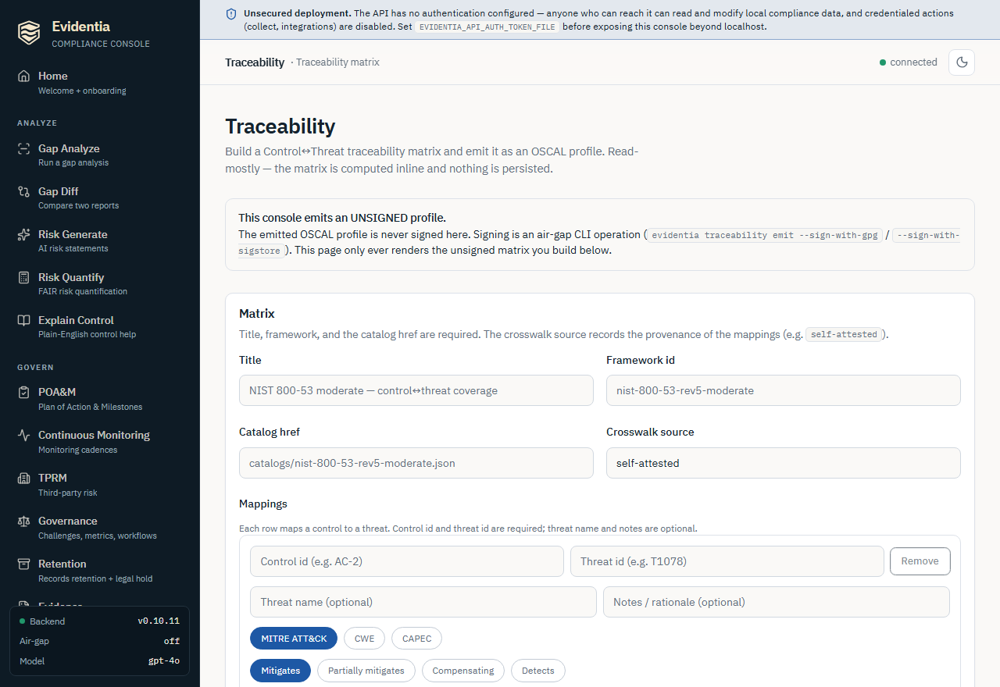

# Emit a control-to-threat traceability matrix

A traceability matrix is the auditor-facing record of *which threats each control
mitigates*. Evidentia takes a small declarative matrix — a list of control→threat
mappings — and emits it as a **signable OSCAL profile**: the profile imports your
control catalog and annotates each control with a `link rel="mitigates"` pointing
at integrity-hashed threat resources in the document's back-matter. You can then
GPG- or Sigstore-sign the emitted profile so an auditor can verify, end to end,
that the coverage claims came from your instance and have not been altered.

This guide walks the full workflow with the `evidentia traceability emit` command,
then shows the read-only equivalent in the web console.

> **Representation note.** A static control↔threat matrix is emitted as an OSCAL
> **profile** — deliberately *not* Assessment Results (which models an assessment
> *activity*) and *not* the OSCAL `mapping` model (which is control↔control only
> and cannot target a threat id). The relationship vocabulary (`mitigates`,
> `detects`, …) is a domain mitigation vocabulary, not NIST OLIR.

## Prerequisites

- **A control catalog** the profile can import — referenced by `catalog_href`
  (for example `catalogs/nist-800-53-rev5-moderate.json`). The matrix annotates
  this catalog's controls; it does not need the catalog file present to emit, but
  the href is what downstream tools resolve.
- **A traceability matrix input file** (JSON or YAML) describing your mappings.
  You author this by hand or generate it from your threat-modeling notes — see
  [Step 1](#step-1-author-the-matrix-input).
- **(Optional) signing material.** A GPG key id for an air-gap detached signature,
  or the `[sigstore]` extra plus network + an OIDC credential for a keyless
  Sigstore signature. See [Sign and verify evidence](sign-and-verify-evidence.md)
  for the signing setup that this command reuses.

## The matrix input

The input is a `TraceabilityMatrix`: a few header fields plus a list of mappings.
Each mapping says *one control mitigates one threat*, with a relationship and a
coverage strength.

| Field | Required | Notes |
| --- | --- | --- |
| `title` | yes | Human-readable matrix title. |
| `catalog_href` | yes | OSCAL href of the control catalog the profile imports. |
| `framework_id` | yes | Framework identifier, e.g. `nist-800-53-rev5-moderate`. |
| `crosswalk_source` | no | Provenance of the mappings; defaults to `self-attested`. |
| `mappings[]` | yes | One or more control→threat mappings (see below). |

Each mapping carries:

- **`control_id`** (required) — control id from the imported catalog, e.g. `AC-2`.
- **`threat_id`** (required) — canonical threat id, e.g. `T1078`, `CWE-79`, `CAPEC-66`.
- **`threat_framework`** (required) — the threat taxonomy: `mitre-attack`, `cwe`, or `capec`.
- **`relationship`** — `mitigates` (default), `partially-mitigates`, `compensating`, or `detects`.
- **`coverage`** — `full` (default), `partial`, or `compensating`.
- **`threat_name`** — optional human-readable name. A given threat id must use one
  consistent name across the matrix, or emit fails fast.
- **`notes`** — optional operator rationale.

## Step 1 — Author the matrix input

Create a YAML (or JSON) file describing the mappings. A minimal example:

```yaml
title: "Control-to-Threat Traceability: Acme moderate baseline"
catalog_href: "catalogs/nist-800-53-rev5-moderate.json"
framework_id: "nist-800-53-rev5-moderate"
crosswalk_source: "self-attested"
mappings:
  - control_id: "AC-2"
    threat_id: "T1078"
    threat_framework: "mitre-attack"
    threat_name: "Valid Accounts"
    relationship: "mitigates"
    coverage: "partial"
  - control_id: "AC-6"
    threat_id: "T1078"
    threat_framework: "mitre-attack"
    threat_name: "Valid Accounts"
    relationship: "partially-mitigates"
    coverage: "partial"
```

## Step 2 — Emit the OSCAL profile

`--input` / `-i` (the matrix file) and `--output` / `-o` (where to write the
profile JSON) are both required:

```bash
evidentia traceability emit --input matrix.yaml --output traceability-profile.json
```

On success the command reports the count of mappings and distinct controls:

```
Wrote OSCAL profile: traceability-profile.json  (2 mappings across 2 controls)
```

The emitted file is a single OSCAL `profile` document. Its metadata records the
matrix title, the Evidentia version, the OSCAL schema version, and the
`crosswalk-source`; each mapping becomes a `link rel="mitigates"` addition on the
target control, and each distinct threat is embedded as a SHA-256-hashed
`back-matter.resources[]` entry for tamper-evidence. Re-emitting the same input
reproduces byte-identical resource ids and digests (the ids are derived
deterministically), so the output is stable for diffing and CI.

If the matrix parses but has no mappings, emit refuses with *"The matrix has no
mappings — nothing to emit."* and exits non-zero.

## Step 3 — (Optional) sign the profile

Signing is the same path the rest of Evidentia's OSCAL signing uses. Pass a GPG
key id to write a detached `.asc` next to the profile — the air-gap-friendly
default:

```bash
evidentia traceability emit --input matrix.yaml --output traceability-profile.json --sign-with-gpg YOUR_KEY_ID
```

This writes `traceability-profile.json` plus `traceability-profile.json.asc`.

For a keyless Sigstore signature (writes `<output>.sigstore.json`), add
`--sign-with-sigstore`. Sigstore needs network access to Fulcio + Rekor and an
OIDC credential, so it is refused in `--offline` mode. In CI you can pass an
explicit token rather than relying on auto-detection. Because this block uses a
trailing line-continuation, it is shown per shell:

**Bash / Linux / macOS**

```bash
evidentia traceability emit \
  --input matrix.yaml \
  --output traceability-profile.json \
  --sign-with-sigstore \
  --sigstore-identity-token "$OIDC_TOKEN"
```

**PowerShell (Windows)**

```powershell
evidentia traceability emit `
  --input matrix.yaml `
  --output traceability-profile.json `
  --sign-with-sigstore `
  --sigstore-identity-token $env:OIDC_TOKEN
```

You can pass both `--sign-with-gpg` and `--sign-with-sigstore` in one emit for
defense-in-depth.

## Step 4 — Verify the signature

The emitted profile verifies through the same `evidentia oscal verify` path as
any signed OSCAL document. `--require-signature` fails if no detached signature
is found next to the file; either a GPG `.asc` *or* a Sigstore bundle satisfies
the requirement:

```bash
evidentia oscal verify traceability-profile.json --require-signature
```

It exits `0` on success and `1` otherwise, so it drops straight into a CI gate.
For an air-gap-only check (no Sigstore/Rekor contact) add `--no-check-sigstore`;
for machine-readable output add `--json`. See
[Sign and verify evidence](sign-and-verify-evidence.md) for the full verification
surface, including pinning an expected Sigstore signer identity.

## Emitting from the web console

Everything above — *except signing* — is also available in the browser. Start the
server with `evidentia serve` and open the **Traceability** screen from the
sidebar (route `/traceability`). The screen calls `POST /api/traceability/emit`.

<!-- TODO(live-verify): capture docs/wiki/images/screen-traceability.png from the running /traceability console, then restore:  -->

The console is **read-mostly and never signs.** It builds the matrix inline from
the form, posts it, and renders the returned **unsigned** OSCAL profile as
pretty-printed JSON. A banner on the page states this explicitly: signing
(`--sign-with-gpg` / `--sign-with-sigstore`) is an air-gap CLI operation by
design and is deliberately not exposed over HTTP.

1. **Fill the matrix header.** Enter a **Title**, a **Framework id**, and a
   **Catalog href** — all three are required. The **Crosswalk source** is optional
   and defaults to `self-attested`.
2. **Add mappings.** Each mapping row takes a **Control id** and a **Threat id**
   (both required), an optional **Threat name** and **Notes**, plus three pill
   pickers: **Threat framework** (MITRE ATT&CK / CWE / CAPEC), **Relationship**
   (Mitigates / Partially mitigates / Compensating / Detects), and **Coverage**
   (Full / Partial / Compensating). Use **Add mapping** for more rows and
   **Remove** to drop one (the last remaining row cannot be removed).
3. **Emit.** The **Emit** button stays disabled until the title, framework id,
   catalog href, and at least one mapping with both a control id and a threat id
   are filled. Clicking it posts the matrix and renders an **Emitted OSCAL
   profile** card — flagged **Unsigned** — with a small control/threat-link count
   summary and the full profile JSON. A matrix with no usable mappings returns a
   `400` ("nothing to emit"); a shape-invalid body returns a `422`, surfaced as an
   inline error.
4. **Sign it from the CLI.** Nothing is persisted server-side, so to produce a
   *signed* artifact, copy the matrix into an input file and run
   `evidentia traceability emit … --sign-with-gpg/--sign-with-sigstore` as in
   [Step 3](#step-3-optional-sign-the-profile).

## What's next

- **Sign and verify the emitted profile**:
  [Sign and verify evidence](sign-and-verify-evidence.md) — the GPG / Sigstore
  signing and `oscal verify` surface this command reuses.
- **The integrity model behind the hashed threat resources**:
  [Concepts → Evidence integrity](../3-concepts/evidence-integrity.md).
- **Find the controls worth mapping**:
  [Run a gap analysis](run-gap-analysis.md) surfaces your in-scope controls.
- **Run everything offline**: [Air-gapped install](air-gapped-install.md) — emit
  and GPG-sign work air-gapped; Sigstore signing does not.

## Got stuck?

- **"The matrix has no mappings — nothing to emit."** — your `mappings` list is
  empty (or every row was dropped). Add at least one mapping with a `control_id`
  and `threat_id`.
- **"threat … has conflicting names …"** — the same threat id appears with two
  different `threat_name` values. A threat id must map to one name across the
  whole matrix; pick one.
- **`Invalid traceability matrix input:` on emit** — the input failed validation
  (a missing required field, or an out-of-range enum like an unknown
  `threat_framework`/`relationship`/`coverage`). Check the field against
  [The matrix input](#the-matrix-input) above.
- **"No such command 'traceability'"** — your installed `evidentia` predates
  v0.10.11. Upgrade to v0.10.11 or later.
- **Sigstore signing fails in `--offline` mode** — that is by design. Sigstore
  needs Fulcio + Rekor; use `--sign-with-gpg` for air-gapped signing instead.
