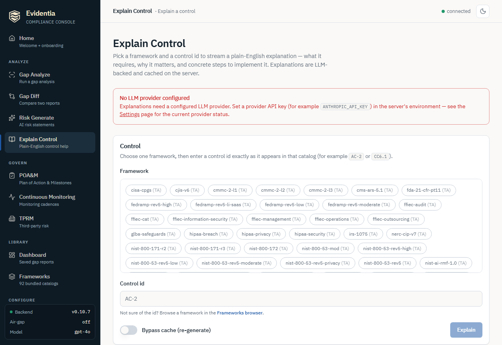

# Explaining a control in the web console

Compliance control text is written for auditors — dense, formal, and built for
legal defensibility. The **Explain Control** screen in the web console turns a
single control into a plain-English brief an engineer or executive can act on:
what the control actually requires, why it matters (anchored to real attack
patterns), concrete implementation steps, and an honest effort estimate. The
explanation streams into the page as the model produces it, and the server
caches the result so the next person asking for the same control gets it
instantly.

This is the browser-native counterpart to the CLI's `evidentia explain`. It runs
the same `evidentia-ai` explanation engine — there is no UI-only explanation
path.



## Prerequisites

- **The web UI running.** Start it with `evidentia serve` (it needs the `[gui]`
  extra). See [Serve the local web UI](serve-the-web-ui.md) for the full setup.
  Then browse to `http://127.0.0.1:8000/explain`.
- **An LLM provider configured.** Explanations are LLM-backed, so the server
  needs a provider API key in its environment (for example `ANTHROPIC_API_KEY`).
  Keys are read from the environment only — the browser never sees a key value.
  The screen shows a banner if no provider is configured, and the
  [Settings](serve-the-web-ui.md#step-2--open-the-ui) screen lists the live
  provider status. Air-gapped operators who run a local model endpoint can point
  the provider config at it; a control with no reachable model surfaces the
  failure inline rather than hanging.

You can confirm a provider is wired up from a second terminal:

```bash
curl -s http://127.0.0.1:8000/api/llm-status
```

The response reports each provider's `configured` boolean and the active model —
never any key material.

## Step 1 — Open the Explain screen

In the sidebar, under **Analyze**, click **Explain Control** (route `/explain`).
The screen has a single configuration card: a framework picker, a control-id
input, and a **Bypass cache** toggle.

## Step 2 — Pick a framework

Click exactly one framework chip. Each chip shows its redistribution tier as
`(T…)`. Unlike the multi-select on **Gap Analyze**, Explain operates on one
control in one framework at a time, so the picker is single-choice.

If you are not sure which frameworks are registered, the
[Frameworks browser](serve-the-web-ui.md#step-2--open-the-ui) (`/frameworks`)
lists them all and lets you drill into any catalog.

## Step 3 — Enter a control id

Type the control id exactly as it appears in that framework's catalog — for
example `AC-2` for a NIST 800-53 control, or `CC6.1` for a SOC 2 TSC criterion.
The id is case- and format-sensitive: it has to match the catalog entry. If you
do not know the id, open the framework in the **Frameworks** browser and copy it
from the control list.

The **Explain** button stays disabled until you have both selected a framework
and entered a control id.

## Step 4 — (Optional) bypass the cache

The server caches each explanation on disk keyed by
`(framework, control, model, temperature)`, so repeat requests for the same
control return immediately without a fresh model call. Leave **Bypass cache**
off to use that cache.

Flip **Bypass cache** on to force a brand-new generation — useful after you have
changed the configured model, or if you want a fresh phrasing. A bypassed
request always calls the model, so it takes the full generation time and then
overwrites the cached copy.

## Step 5 — Stream the explanation

Click **Explain**. The page enters an **Explaining…** state immediately while it
waits on the model. A cache hit returns almost instantly; a cold-cache control
can take several seconds while the model generates.

When the result arrives, an explanation card renders with the control title, its
`framework:control` id, the model that produced it, and these sections:

| Section | What it tells you |
| --- | --- |
| **In plain English** | A one- or two-sentence summary of what the control requires, with no jargon. |
| **Why it matters** | The threat the control mitigates and the business impact of leaving the gap open, tied to a real-world attack pattern. |
| **What to do** | A short list of concrete, actionable implementation steps. |
| **Effort estimate** | An honest, implementer's-eye sizing — from a one-afternoon change to a multi-month program. |
| **Common misconceptions** | (When present) the ways the control's intent is commonly misread. |

If generation fails — an unreachable model, an unconfigured provider, or a
control id the catalog does not contain — the screen surfaces the server's error
message in a red alert instead of a result card. Fix the cause (provider config,
or the control id) and click **Explain** again.

> The screen calls `POST /api/explain/{framework}/{control_id}`, which streams
> the result over Server-Sent Events. The endpoint emits a `start` frame to keep
> the browser responsive, then a single terminal frame carrying the full
> explanation (or an error). The payload is the same `PlainEnglishExplanation`
> shape the CLI's `evidentia explain` produces.

## What's next

- **Find the gaps worth explaining**: [Run a gap analysis](run-gap-analysis.md)
  surfaces your open controls; explain the ones you are unsure how to close.
- **Turn a gap into a tracked plan**: [Manage POA&M](manage-poam.md) records the
  remediation work the explanation describes.
- **Quantify the risk of leaving it open**:
  [Generate and quantify risk](generate-and-quantify-risk.md).
- **Run everything offline**: [Air-gapped install](air-gapped-install.md) — the
  console keeps its `127.0.0.1` bind; pair it with a local model endpoint.

## Got stuck?

- **"No LLM provider configured" banner** — the server has no provider API key
  in its environment. Set one (for example `ANTHROPIC_API_KEY`) and restart
  `evidentia serve`, then reload the page. Confirm with
  `curl -s http://127.0.0.1:8000/api/llm-status`.
- **"Control '…' not found in '…'"** — the control id does not match that
  framework's catalog. Open the framework in the **Frameworks** browser and copy
  the exact id (ids are format-sensitive, e.g. `AC-2`, not `ac2`).
- **"Framework '…' not found"** — that framework id is not registered. Pick a
  chip from the picker rather than guessing an id.
- **The explanation takes a long time** — a cold-cache control calls the model
  live; that is expected. Subsequent requests for the same control hit the cache
  and return instantly (unless you toggle **Bypass cache**).
- **The phrasing looks stale after a model change** — toggle **Bypass cache** on
  and re-run to regenerate and overwrite the cached copy.
