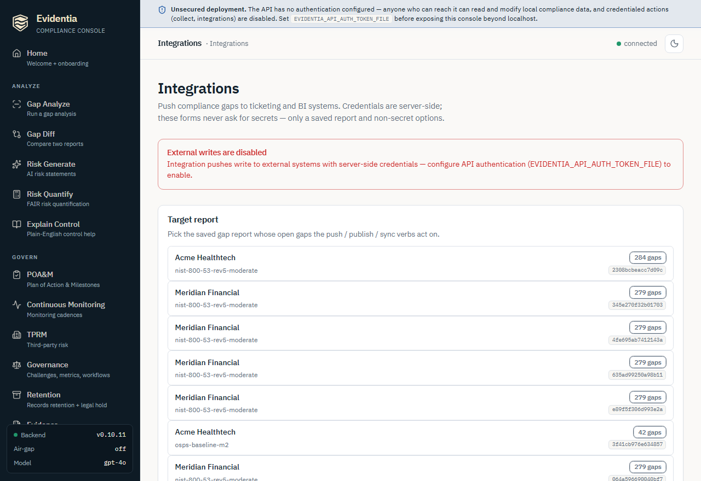

# Push findings to Jira, ServiceNow, and BI tools

Once a gap analysis has surfaced your open compliance gaps, the next step is to
get them in front of the people who close them — and to keep your dashboards
honest. The `evidentia integrations` group does both: it pushes open gaps into a
**ticketing system** (Jira Cloud, ServiceNow) so each gap becomes a tracked,
assignable record, and it publishes a **gap inventory + risk register + run
audit trail** to a **BI tool** (Tableau, Power BI) so leadership sees live
posture instead of a stale slide. This guide walks the full workflow with the
`evidentia integrations` commands and the browser equivalent.

This is a **credentialed, external-write** surface. Every push / publish / sync
verb reaches *out* to a system you do not control and creates records there.
That has two consequences worth stating up front:

- **Credentials are never passed on the command line or in a form.** Every
  integration reads its secrets from **server-side environment variables**
  (and, for Tableau / Power BI, from env vars you *name* rather than whose value
  you type). Nothing in this guide ever asks you to paste a token into a flag or
  a browser field.
- **The writes are irreversible from Evidentia's side.** A pushed Jira issue or
  ServiceNow incident stays in that system until someone there closes it. Test
  the connection first, and use the safety rails (`--max`, dry-run) on the first
  run.

## Prerequisites

- **A gap-analysis report JSON.** Every verb operates on the output of
  `evidentia gap analyze --output gap-report.json`
  (see [Run a gap analysis](run-gap-analysis.md)). Push verbs act on the report's
  **open** gaps; the publish verbs ship the whole inventory.
- **The integration extra installed.** Tableau and Power BI ship as optional
  extras: `pip install 'evidentia-integrations[tableau]'` /
  `'evidentia-integrations[powerbi]'`. Jira and ServiceNow ship with the CLI.
- **Credentials in the environment** for whichever target you use (see each
  section below). For the **web console** path, the server process also needs
  these env vars set, plus API authentication configured — covered in
  [§ In the web console](#in-the-web-console).

## Step 1 — Verify your credentials before you write anything

Both ticketing integrations have a read-only `test` verb that probes the
connection without creating a single record. Run it first — a failed `test` is a
cheap, reversible way to catch a wrong URL or an expired token.

Jira reads four environment variables — `JIRA_BASE_URL`, `JIRA_EMAIL`,
`JIRA_API_TOKEN`, `JIRA_PROJECT_KEY` (and an optional `JIRA_ISSUE_TYPE`,
defaulting to `Task`):

**Bash / Linux / macOS**

```bash
export JIRA_BASE_URL="https://acme.atlassian.net"
export JIRA_EMAIL="compliance-bot@acme.example"
export JIRA_PROJECT_KEY="SEC"
# Set JIRA_API_TOKEN in your shell yourself — never echo a secret.
evidentia integrations jira test
```

**PowerShell (Windows)**

```powershell
$env:JIRA_BASE_URL = "https://acme.atlassian.net"
$env:JIRA_EMAIL = "compliance-bot@acme.example"
$env:JIRA_PROJECT_KEY = "SEC"
# Set JIRA_API_TOKEN in your shell yourself — never echo a secret.
evidentia integrations jira test
```

ServiceNow reads `EVIDENTIA_SERVICENOW_INSTANCE_URL`,
`EVIDENTIA_SERVICENOW_USER`, `EVIDENTIA_SERVICENOW_PASSWORD`, and an optional
`EVIDENTIA_SERVICENOW_TABLE` (default `incident`):

**Bash / Linux / macOS**

```bash
export EVIDENTIA_SERVICENOW_INSTANCE_URL="https://acme.service-now.com"
export EVIDENTIA_SERVICENOW_USER="evidentia.integration"
# Set EVIDENTIA_SERVICENOW_PASSWORD in your shell yourself.
evidentia integrations servicenow test
```

**PowerShell (Windows)**

```powershell
$env:EVIDENTIA_SERVICENOW_INSTANCE_URL = "https://acme.service-now.com"
$env:EVIDENTIA_SERVICENOW_USER = "evidentia.integration"
# Set EVIDENTIA_SERVICENOW_PASSWORD in your shell yourself.
evidentia integrations servicenow test
```

Each `test` exits `0` on success and `1` on any credential or API failure, so it
slots cleanly into a CI pre-flight check.

## Step 2 — Push open gaps to a ticketing system

### Jira

`push` creates one Jira issue per open gap in the report. Any gap that already
carries a `jira_issue_key` is **skipped**, so re-running is safe and won't
duplicate issues. On a first run, cap the blast radius with `--max` and skip the
write-back with a dry-run (`--output -`):

```bash
evidentia integrations jira push --gaps gap-report.json --severity critical,high --max 25 --output -
```

When you are happy with the dry run, drop `--output -` to let `push` write the
stamped issue keys back into the report (it overwrites the input file by default,
or pass `--output updated-report.json` to write a copy):

```bash
evidentia integrations jira push --gaps gap-report.json --severity critical,high
```

`--severity` (`-s`) takes a comma-separated list and defaults to all severities.
`push` exits `0` when every create succeeds and `1` when any errored.

### ServiceNow

`push` creates a record (an `incident`, an `sn_grc_issue`, or a custom-table
record, per `EVIDENTIA_SERVICENOW_TABLE`) per open gap. It is **idempotent by
`correlation_id`**: re-running on the same report detects records it already
created and reports them as *existing* rather than creating duplicates.

```bash
evidentia integrations servicenow push --gaps gap-report.json
```

The `--force` flag creates new records even when a matching `correlation_id`
already exists — rarely needed, mostly for testing.

## Step 3 — Sync ticket status back into the report (Jira)

After your team works tickets in Jira, pull their current status back so
Evidentia's gap statuses reflect reality. `sync` reads the status of every
linked gap (each gap that carries a `jira_issue_key`) and maps it back onto the
report:

```bash
evidentia integrations jira sync --gaps gap-report.json
```

Like `push`, `sync` overwrites the input report by default; pass `--output`
(`-o`) to write a copy. To see exactly how Jira statuses translate to
Evidentia's `GapStatus`, print the mapping table:

```bash
evidentia integrations jira status-map
```

Add `--format json` (`-f json`) for the machine-readable form. (ServiceNow has
no `sync` verb at this release — it is push-only.)

## Step 4 — Publish to a BI tool

The BI verbs publish three datasets — the **gap inventory**, the **risk
register**, and the **collection-run audit trail** — so a Tableau or Power BI
dashboard can chart posture directly.

### Tableau

The Tableau **PAT name and secret are read server-side from env vars** — you
pass the *names* of those env vars, never the values. The defaults are
`TABLEAU_PAT_NAME` and `TABLEAU_PAT_SECRET`. Because the command takes a
`--server-url` and reads named env vars, it is shell-specific:

**Bash / Linux / macOS**

```bash
export TABLEAU_PAT_NAME="evidentia-pat"
# Set the secret in your shell; never echo it.
export TABLEAU_PAT_SECRET="…"
evidentia integrations tableau publish \
  --gaps gap-report.json \
  --server-url https://us-east-1.online.tableau.com \
  --site-id acmecompliance \
  --project-name "Compliance"
```

**PowerShell (Windows)**

```powershell
$env:TABLEAU_PAT_NAME = "evidentia-pat"
# Set the secret in your shell; never echo it.
$env:TABLEAU_PAT_SECRET = "…"
evidentia integrations tableau publish `
  --gaps gap-report.json `
  --server-url https://us-east-1.online.tableau.com `
  --site-id acmecompliance `
  --project-name "Compliance"
```

`--server-url` must carry **no trailing slash**. `--site-id` is the Tableau
Cloud site slug (leave empty for a Tableau Server default site).
`--project-name` defaults to `default`. By default a re-publish **overwrites**
the existing data sources; pass `--no-overwrite` to publish in CreateNew mode and
fail if they already exist. Add `--risks <path>` to publish a JSON list of
`RiskStatement` objects as the `evidentia-risks` dataset.

### Power BI

Power BI publishes the same datasets as **Push Datasets** via an Azure AD
service principal. The **client secret is read server-side** from the env var you
name with `--client-secret-env` (default `POWERBI_CLIENT_SECRET`); the
`--workspace-id`, `--tenant-id`, and `--client-id` are non-secret identifiers
passed as flags:

**Bash / Linux / macOS**

```bash
# Set POWERBI_CLIENT_SECRET in your shell yourself; never echo it.
evidentia integrations powerbi publish \
  --gaps gap-report.json \
  --workspace-id 00000000-0000-0000-0000-000000000000 \
  --tenant-id 11111111-1111-1111-1111-111111111111 \
  --client-id 22222222-2222-2222-2222-222222222222
```

**PowerShell (Windows)**

```powershell
# Set POWERBI_CLIENT_SECRET in your shell yourself; never echo it.
evidentia integrations powerbi publish `
  --gaps gap-report.json `
  --workspace-id 00000000-0000-0000-0000-000000000000 `
  --tenant-id 11111111-1111-1111-1111-111111111111 `
  --client-id 22222222-2222-2222-2222-222222222222
```

The service principal needs `Dataset.ReadWrite.All` on the target workspace. By
default each publish is a full refresh (clear-then-push); pass `--no-clear` to
append rows to the existing datasets instead. Add `--risks <path>` to include a
risk-register dataset.

## In the web console

Everything above is mirrored on the **Integrations** screen. Start the server
with `evidentia serve` (it needs the `[gui]` extra — see
[Serve the local web UI](serve-the-web-ui.md)) and open **Integrations** from the
sidebar (route `/integrations`). The page is organized as one card per system —
**Jira**, **ServiceNow**, **Tableau**, **Power BI** — backed by the
`/api/integrations/...` routes.



The console preserves the same secrets discipline as the CLI: **the forms never
ask for a token.** Credentials are sourced server-side from the same environment
variables, so the server process must have them set before you start it. The
forms carry only a saved-report key plus non-secret options.

1. **Pick a target report.** The **Target report** card lists your saved gap
   reports (each showing the organization, framework set, gap count, and report
   key). Pick one — every push / publish / sync verb acts on its open gaps, and
   the write controls stay disabled until a report is selected. If the list is
   empty, run `evidentia gap analyze` first to populate the gap store.
2. **Run the read-only probes freely.** **Test connection** (Jira / ServiceNow)
   and Jira's **Status map** create no records and stay enabled regardless of
   auth state. Use them to confirm the server-side credentials are wired before
   you write anything. Results render as structured text below the buttons.
3. **Confirm before every external write.** Each write verb — **Push gaps**,
   **Sync status**, **Publish** — is guarded by a two-step confirmation: the
   first click reveals *"This writes to &lt;system&gt;. Continue?"* and only the
   **Confirm** click fires the request. This interstitial exists because the
   write is irreversible. Errors (a `503` not-configured, a `404` unknown report
   key) surface in a red alert with the server's payload.
4. **Auth-gating of the write buttons.** On an **anonymous deployment** — one
   with no API authentication configured — every *write* verb is **disabled**
   with the note *"External writes are disabled."* Because these verbs perform
   credentialed external writes with server-side secrets, the console requires
   the server to have API auth configured (set `EVIDENTIA_API_AUTH_TOKEN_FILE`
   and restart `evidentia serve`) before it will enable them. The read-only
   test / status-map probes stay enabled either way. This is the
   browser-equivalent of the CLI relying on a credentialed operator shell.

> The console reads `GET /api/health` once on load to learn whether auth is
> configured (`auth_configured`), then calls
> `POST /api/integrations/jira/push/{report_key}` (and the analogous `sync`,
> `servicenow/push`, `tableau/publish`, `powerbi/publish` routes). The
> ServiceNow push is additionally written to the structured audit log
> (`evidentia.integrations.servicenow_push`) with the report key, target table,
> and outcome counts — never any secret value.

## What's next

- **Generate the report these verbs consume**:
  [Run a gap analysis](run-gap-analysis.md).
- **Track remediation alongside the tickets**: [Manage POA&M](manage-poam.md) —
  a POA&M milestone's `--evidence-ref` can point at the Jira key or ServiceNow
  record a push created.
- **Quantify what the open gaps cost**:
  [Generate and quantify risk](generate-and-quantify-risk.md) — the risk
  register the BI publishes can carry these `RiskStatement` objects.
- **Run the console behind a real auth boundary**:
  [Serve the local web UI](serve-the-web-ui.md).

## Got stuck?

- **`test` exits 1 / "Jira API call failed"** — the credentials or URL are
  wrong, or the token expired. Re-check the four `JIRA_*` env vars (or the
  `EVIDENTIA_SERVICENOW_*` set) in the *server's* environment. `test` never
  prints the token, so a clean re-export is safe.
- **Console write buttons are greyed out with "External writes are disabled"** —
  the deployment is anonymous. Configure API authentication
  (`EVIDENTIA_API_AUTH_TOKEN_FILE`) and restart `evidentia serve`. The read-only
  probes work without it.
- **"Select a target report above to enable this write."** — no report is
  selected in the **Target report** card. Pick one; if the list is empty, run
  `evidentia gap analyze` to populate the gap store.
- **A `503` "integration not installed"** — Tableau / Power BI ship as extras.
  Install with `pip install 'evidentia-integrations[tableau]'` or
  `'[powerbi]'`.
- **Jira `push` skipped gaps it "should" have created** — any gap already
  carrying a `jira_issue_key` is skipped by design (re-run safety). Inspect the
  report, or push to a fresh report copy.
- **ServiceNow `push` reported records as *existing*** — that is the idempotency
  guard working: matching `correlation_id`s are not duplicated. Use `--force`
  only if you truly need duplicate records (rare; mostly for testing).
