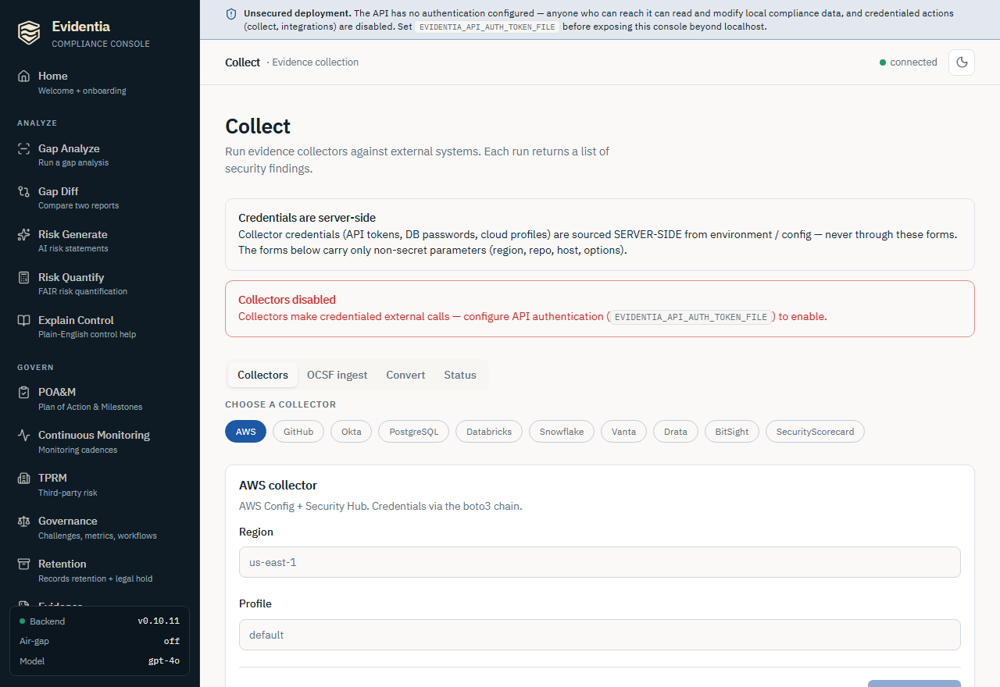

# Run evidence collectors

Collectors are how Evidentia learns *what your real systems actually do*. Each one
makes an outbound, authenticated call to an external system — AWS, GitHub, Okta, a
SQL database, a SaaS GRC platform — and returns a list of `SecurityFinding` records
mapped to control families. This guide covers the full collector surface: the
`evidentia collect` command group on the CLI, and the credentialed **Collect**
screen in the web console. Entra/M365 also accepts a local DLP export and
reports a full collection result rather than a bare findings array.

This is the *operator* reference for the whole collector matrix. If you have never
run a collector before, start with the gentler end-to-end walkthrough in
[Getting started → Your first evidence collection](../1-getting-started/first-collection.md),
which wires the GitHub collector start-to-finish; this guide assumes you already
understand that shape and focuses on the breadth of providers, the credential
model, and the network/SSRF guards.

## What this surface is for

- **Pull live posture** from a source system and turn it into control-mapped
  findings you can fold into a gap analysis (`--format oscal-ar`) or convert to
  OCSF for a SIEM.
- **Cover many providers** — cloud (AWS), code (GitHub), identity (Okta, Google
  Workspace), data stores (PostgreSQL, MySQL, SQLite, MS SQL, Oracle, Databricks,
  Snowflake), and vendor-risk platforms (Vanta, Drata, BitSight, SecurityScorecard).
- **Ingest or convert OCSF** — pull third-party OCSF findings *in* (`collect ocsf`)
  or push Evidentia findings *out* to an OCSF bundle (`collect convert`).

Every credentialed collector is **read-only by design**. The SQL adapters even run
a write-privilege probe on first connect and emit an `EVIDENTIA-WRITE-PRIV-DETECTED`
finding (mapped to NIST AC-6) if they find more access than they should have.

## The credential model (read this first)

This is the highest-risk surface in Evidentia, so the credential handling is
deliberate and worth understanding before you run anything:

- **Secrets never pass through a CLI value flag or a request body.** Tokens and
  passwords are sourced from **server-side environment variables** (or the
  provider SDK's own credential chain). For example the GitHub collector reads
  `$GITHUB_TOKEN`; Okta reads `$OKTA_API_TOKEN`; the SQL adapters read a password
  from an env var you name with `--password-env`. The collectors *refuse* a
  secret passed as a flag.
- **In the web console, the forms only carry non-secret parameters** — region,
  repo, host, options. The browser never sees a key value, and the **Status** tab
  reports only `configured: true/false` plus the env-var name a token came from,
  never the value.
- **Networked collectors block private IPs by default** (`--block-private-ips`).
  This SSRF guard refuses any host that resolves to a private / loopback /
  link-local / multicast / reserved range — including the cloud
  instance-metadata endpoint `169.254.169.254` — *before* a socket opens. You opt
  out per-call with `--allow-private-ips` only for a trusted internal endpoint.

## Prerequisites

- Evidentia installed (`pip install evidentia`; verify with `evidentia version`).
- The provider extra for whatever you are collecting — for example
  `pip install "evidentia-collectors[aws]"` or
  `pip install "evidentia-core[ocsf]"` for the OCSF verbs. A missing extra surfaces
  as a clear install hint rather than a stack trace.
- The relevant credential exported in your shell (CLI) or set in the server's
  environment (console). See each provider's `--help` for the exact env-var name.

## Step 1 — See what you can collect

List the whole collector matrix:

```bash
evidentia collect --help
```

You will see the credentialed providers (`aws`, `github`, `okta`,
`google-workspace`, `entra-m365`, `retention`, `sql`, `databricks`, `snowflake`, `vanta`, `drata`, `bitsight`,
`securityscorecard`) plus the two OCSF verbs (`ocsf` to ingest, `convert` to
emit). Each subcommand has its
own `--help` with the exact flags and the env var its secret is read from:

```bash
evidentia collect github --help
```

## Step 2 — Configure the credential

Each collector documents its credential source in `--help`. The token/password is
always read from the environment, never a flag. For GitHub:

**Bash / Linux / macOS**

```bash
export GITHUB_TOKEN=ghp_your_token_here
```

**PowerShell (Windows)**

```powershell
$env:GITHUB_TOKEN = "ghp_your_token_here"
```

For the SQL adapters, the password lives in the env var named by `--password-env`
(default differs per adapter, e.g. `EVIDENTIA_POSTGRES_PASSWORD`). For the
SaaS/vendor-risk collectors, set the provider's token env var (`OKTA_API_TOKEN`,
`GOOGLE_WORKSPACE_ACCESS_TOKEN`, `VANTA_API_TOKEN`, `DRATA_API_TOKEN`,
`BITSIGHT_API_TOKEN`, `SECURITYSCORECARD_API_TOKEN`, `SNOWFLAKE_PASSWORD`, etc.).

## Step 3 — Run a collector

Run one provider and write the findings JSON to a file with `--output` (or omit it
to print to stdout). A plain `evidentia collect ...` line works the same in any
shell:

```bash
evidentia collect github --repo octocat/Hello-World --output findings.json
```

A few representative providers:

```bash
evidentia collect aws --region us-east-1 --output aws-findings.json
```

```bash
evidentia collect okta --org-url https://your-org.okta.com --output okta-findings.json
```

```bash
evidentia collect google-workspace --customer my_customer --output google-workspace-findings.json
```

### Entra ID and Microsoft 365

`evidentia collect entra-m365` returns a result envelope with findings, a manifest
and all nine capability records. It is not a bare findings array. The capability
names are `conditional-access`, `authentication-registration`, `sign-ins`,
`directory-roles`, `managed-devices`, `retention-labels`, `dlp-export`,
`defender-alerts` and `defender-incidents`. Omit `--capability` to request all nine,
or repeat it to choose a subset.

The alias supplied through `--tenant-label` must start with an ASCII letter or
digit and contain at most 64 letters, digits, underscores, periods or hyphens.
It is an operator label, not a verified tenant ID. Tokens are never decoded to
infer identity. Provision pre-minted tokens through the operator's secret
management process, using these fixed environment references:

| Reference | Use |
| --- | --- |
| `ENTRA_M365_ACCESS_TOKEN` | Seven Graph capabilities other than retention labels. |
| `ENTRA_M365_AUTH_MODE` | Declared primary mode: `application` (default) or `delegated`. |
| `ENTRA_M365_RETENTION_ACCESS_TOKEN` | Separate delegated token for retention labels, with no fallback to the primary token. |

The collector only makes GET requests to eight fixed commercial Graph v1.0
collections. It does not acquire or refresh tokens, execute PowerShell, accept
an arbitrary host, or allow private-address access. Source permissions, delegated
roles and licensing are separate requirements; see the
[permission and evidence boundary tables](https://github.com/Polycentric-Labs/evidentia/blob/main/docs/designs/entra-m365-collector-design.md).
A 403 does not identify which of those requirements is missing. A primary-token
401 stops later reuse of that token while retaining independent retention and
DLP evidence.

After configuring an authorized token, this command requests two capabilities.
It is identical in Bash and PowerShell:

```bash
evidentia collect entra-m365 --tenant-label audit-sample --capability conditional-access --capability sign-ins --lookback-days 7 --max-items 1000 --max-pages 10 --output entra-result.json
```

`--lookback-days` accepts 1 through 30 (default 30), `--max-items` accepts 1
through 10,000 (default 10,000), and `--max-pages` accepts 1 through 100 (default
100). Event timestamps retain source precision and the result distinguishes the
requested window from the first and last observed events. A limit that stops
collection leaves partial evidence after an accepted page, or unavailable
evidence before one. A terminal page exactly at a cap can still complete.

DLP configuration comes from a local UTF-8 JSON file of at most 4 MiB. It needs
no token when `dlp-export` is the only selected capability. The default format is
`evidentia-dlp-v1`, which the recorded fixture below uses. Select
`scubagear-provider-v1` explicitly for original provider JSON containing
`dlp_compliance_policies` and `dlp_compliance_rules` arrays. Neither format executes scripts or follows URLs. The
[design](https://github.com/Polycentric-Labs/evidentia/blob/main/docs/designs/entra-m365-collector-design.md) defines the exact policy,
rule and source fields and GUID join rules.

From a repository checkout, this recorded-fixture example runs offline and
works unchanged in Bash or PowerShell:

```bash
evidentia collect entra-m365 --tenant-label recorded-sample --capability dlp-export --dlp-export tests/fixtures/entra_m365/purview/cisa-dlp-recorded.json --dlp-format evidentia-dlp-v1 --output dlp-result.json
```

The fixture preserves 11 policies, 15 rules and publisher-attested provenance.
All policy distribution states are `Pending`; complete enumeration does not
establish enforcement. This is a selected recorded DLP export, not a Graph
recording or a live tenant assessment. Other Graph test fixtures and both console
demo scenarios are explicitly synthetic.

Check `status`, `full_surface_complete` and each capability's `state` before
using the findings. A selected subset can be complete while full-surface
coverage is false. Unrequested capabilities remain `not_requested`; missing,
denied or incomplete evidence is not a compliance pass. Directory roles are
activated-role inventory without memberships or PIM assignments; retention
labels show configuration without item application or immutability proof.

The CLI writes the full valid result before exiting: 0 for complete, 1 for
partial or unavailable, 2 for invalid input, and 77 for an existing read-role
denial. Operational or output failure also exits 1. `--output` uses atomic
replacement after input/output identity and feasibility checks; symlink output
leaves are refused. Without it, stdout contains only JSON and notices use stderr.
Keep the envelope as collection evidence. Consumers requiring a findings array
must explicitly extract `findings` after reviewing completeness.

The API accepts the same request fields at
`POST /api/collectors/entra-m365/collect`, with inline `dlp_content` rather than a
file path. Its entire JSON body is bounded to 8 MiB. Well-formed completed
attempts return HTTP 200 even when evidence is partial or unavailable. Invalid
JSON or fields return sanitized 400 errors, oversized bodies 413 and unsupported
media types 415. Graph requests require configured API authentication and read
RBAC; DLP-only requests retain read RBAC without requiring a Graph credential.
A missing optional collector returns 503 without parsing the export.

In the console, choose the **Entra/M365** tab, select capabilities and enter a
nonsecret alias. Graph collection rechecks authentication immediately before
submission. DLP-only ingestion stays available under the local parsing posture.
All nine states, counts, windows and source limitations remain visible even with
zero findings. The page previews at most 100 findings, with source observations
for the first 10 findings;
**Download full result JSON** retains the complete result. The **Status** tab
reports configuration presence separately from live validation, which remains
false.

### Storage retention

Use this collector to observe retention configuration on explicitly selected S3 general-purpose
buckets, Azure Blob containers and their account/service context, or GCS buckets. It does not list
resources, inspect objects, test deletion, change locks or establish compliance.

Install `evidentia-collectors[retention]` for S3 signing and XML support. Azure and GCS use the base
collector dependencies. Configure only the selected provider's fixed credential references through
your normal secret-management process:

| Provider | Fixed environment references |
| --- | --- |
| S3 | `AWS_ACCESS_KEY_ID`, `AWS_SECRET_ACCESS_KEY`, optional `AWS_SESSION_TOKEN` |
| Azure | `STORAGE_RETENTION_AZURE_ACCESS_TOKEN` |
| GCS | `STORAGE_RETENTION_GCS_ACCESS_TOKEN` |

Tokens must already exist; collection does not acquire or refresh them. Credentials, endpoint URLs,
object keys and adjustable limits are never accepted in the request file. For a synthetic GCS target,
the file shape is:

```json
{
  "provider": "gcs",
  "scope_label": "example-scope",
  "targets": [{"bucket": "example-retention-bucket"}]
}
```

Replace the target with a resource you are authorized to read. Select one provider and 1 through 20
distinct targets. S3 targets use `bucket`, `region` and optional `expected_owner`; Azure targets use
`subscription_id`, `resource_group`, `account` and `container`. The scope label is operator-declared
and does not verify ownership or credential identity.

```bash
evidentia collect retention --help
evidentia collect retention --request-file request.json --output result.json
```

The request must be a named regular JSON file of at most 65536 bytes. Stdin, links and request/output
aliases are refused. Output is reserved before any collection and replaced atomically after the full
result validates. Omit `--output` for stdout. Complete results exit 0; partial/unavailable evidence and
operational failures exit 1; invalid input exits 2; read-role denial exits 77. An exit of 1 may still
produce valid, useful partial evidence, so inspect resource and component diagnostics.

The API equivalent is `POST /api/collectors/retention/collect` with the same JSON object. Configured
authentication and read RBAC precede body parsing and provider access. Valid results return HTTP 200
for every collection status. Invalid JSON/fields return 400, excess streamed bytes 413, unsupported
media 415, absent optional support 503 and unexpected failures a sanitized 500.

In the console, select **Storage retention**, fill the nonsecret scope and target fields, then run.
The tab retains every resource/component state, including unavailable evidence, and provides a full
JSON download. Native source values retain their response spelling, including integers beyond browser
number precision. Findings remain informational with unknown compliance status and no control mappings.
The **Status** tab reports configured reference presence; live-provider and identity validation remain
false. Demo responses and the public HTTP fixtures are explicitly synthetic. See the
[collector design](https://github.com/Polycentric-Labs/evidentia/blob/main/docs/designs/storage-retention-collector-design.md) for exact methods and limits.

### Google Workspace

The Google Workspace collector is read-only against two Admin SDK surfaces: the
Directory API (user inventory, admin roles, 2-Step Verification status) and the
Reports API (login activity). Set `GOOGLE_WORKSPACE_ACCESS_TOKEN` to a
**pre-minted** OAuth 2.0 access token carrying two read-only scopes:
`https://www.googleapis.com/auth/admin.directory.user.readonly` always, and
`https://www.googleapis.com/auth/admin.reports.audit.readonly` when
`--login-window-days` is greater than 0. The collector never mints or refreshes
a token itself, so a very long enumeration against a very large tenant can
outlive the token's roughly one-hour lifetime.

It emits six findings: user inventory, inactive accounts, admin accounts, super
admin 2-Step Verification enrollment, tenant-wide 2-Step Verification
enrollment, and login activity. `--login-window-days` (default 30, range
0-180) controls how far back the Reports API pull looks; setting it to 0 skips
the Reports API entirely, so no login-activity finding is produced and the
manifest records the omission rather than treating it as an error.

Four blind spots are documented on the collector: the pre-minted token has no
refresh path; 2-Step Verification is reported as enrolled/enforced booleans,
not the method in use; login activity is bounded by Google's roughly 180-day
retention window; and `--max-users` / `--max-login-events` truncate very large
tenants (the affected finding records `truncated`).

The SQL adapter takes `--adapter`, a password-free `--connection-uri`, and reads
the password from `--password-env`:

```bash
evidentia collect sql --adapter postgres --connection-uri postgres://reader@db.example.com/app --output db-findings.json
```

SQLite is the exception — no auth, no password env var; pass the database file path
as the connection URI:

```bash
evidentia collect sql --adapter sqlite --connection-uri /var/lib/app/data.db --output sqlite-findings.json
```

## Step 4 — Fold findings into a gap analysis

The payoff: pass a findings file to `evidentia gap analyze` with
`--format oscal-ar` and each finding is embedded in the OSCAL Assessment Results
back-matter with a SHA-256 digest for chain-of-custody:

```bash
evidentia gap analyze --inventory my-controls.yaml --frameworks nist-800-53-rev5-moderate --findings findings.json --format oscal-ar --output assessment-results.json
```

See [Run a gap analysis](run-gap-analysis.md) for the full workflow.

## Step 5 — Ingest or emit OCSF

Pull third-party OCSF findings (Prowler, AWS Security Hub) *in* with
`collect ocsf`. The `--input` accepts a local file path **or** an `https://` URL;
URL mode keeps the `--block-private-ips` SSRF guard on by default:

```bash
evidentia collect ocsf --input prowler.ocsf.json --output findings.json
```

Push Evidentia findings *out* to an OCSF Compliance Finding bundle with
`collect convert`:

```bash
evidentia collect convert --input findings.json --format ocsf --output findings.ocsf.json
```

OCSF has its own dedicated guide — see [Ingest OCSF](ingest-ocsf.md) for the
round-trip and SIEM-ingest path, and [Emit OCSF detection findings](emit-ocsf-detection.md)
for the export side.

## Running collectors in the web console

Everything above also works from the browser. Start the server with
`evidentia serve` and open the **Collect** screen from the sidebar (under
**Connect**, route `/collect`). Its eight tabs are **Collectors**, **Entra/M365**, **Storage retention**,
**OCSF ingest**, **Nessus scan**, **Greenbone report**, **Convert** and **Status**.
The Entra/M365 and Storage retention tabs retain the full result alongside the finding cards.



### The auth gate (why your Run buttons may be disabled)

Collectors make credentialed, network-egressing calls, so the console refuses to
run them on an **unauthenticated** deployment. The page reads the backend's
`auth_configured` flag and, when it is false, shows a red **"Collectors disabled"**
banner and disables every credentialed **Run** button. To enable them, configure
API authentication by pointing `EVIDENTIA_API_AUTH_TOKEN_FILE` at a token file and
restarting `evidentia serve`. This mirrors the always-visible security-posture
banner — it is a §4(c) safeguard so that *anyone* who can reach the local API
cannot silently drive credentialed external calls.

Local parsing stays available without a configured AuthProvider: **Convert**,
**OCSF ingest** with inline content, the Nessus and Greenbone export tabs, and
**Entra/M365** with only DLP export selected. Configured read-role checks still
apply. The **OCSF ingest** *URL* mode *is* networked, so it is
auth-gated like the credentialed collectors.

### Collectors tab

1. **Choose a collector.** Click a provider pill (AWS, GitHub, Okta, Google
   Workspace, PostgreSQL, Databricks, Snowflake, Vanta, Drata, BitSight,
   SecurityScorecard). Each card
   says where its credentials come from (e.g. "Token via server `$GITHUB_TOKEN`").
2. **Fill the non-secret parameters.** The form carries only fields like region,
   repo, org URL, connection URI (without a password), or account/user — never a
   secret. Required fields are marked; the **Run** button stays disabled until
   they are filled (and until auth is configured).
3. **Confirm, then run.** Because a run hits a live external API, the button is a
   two-step: clicking **Run collector** reveals a red **Confirm — run collector**
   button (and a **Cancel**). Confirming issues the run; the page shows
   **Running…** and then a finding count with per-finding cards (severity,
   source system, title, description, resource id). Errors — including the
   provider's own message — are surfaced inline as escaped text.

### OCSF ingest tab

Choose **Inline content** (paste OCSF JSON — a single finding object or an array;
parsed locally, no network) or **URL** (fetch from an `https://` endpoint). URL
mode shows a **Block private IPs (SSRF guard)** checkbox that is **checked by
default**; unchecking it pops a warning that the URL may resolve to a private /
loopback / link-local / metadata address — only opt out for a trusted internal
endpoint. Click **Ingest OCSF** to run.

### Convert tab

Paste a findings document (a single `SecurityFinding` or an array), set the output
format (currently `ocsf`), and click **Convert**. This round-trips through the OCSF
mapping layer entirely locally — no network, no credentials — and prints the
converted JSON.

### Status tab

Reports which collectors are **installed** and which credentials are **configured**
on the server — as booleans plus the env-var name a token was sourced from. It
never returns a token value. Use it to confirm a provider is ready before you try
to run it.

Under the hood the console calls `POST /api/collectors/<provider>/collect` (and
`/api/collectors/ocsf/collect`, `/api/collectors/convert`,
`GET /api/collectors/status`) — the same engine the CLI drives, so the two paths
produce identical findings.

## What's next

- **Your first run, end to end**: [Getting started → Your first evidence collection](../1-getting-started/first-collection.md).
- **Turn findings into a gap report**: [Run a gap analysis](run-gap-analysis.md).
- **Round-trip OCSF**: [Ingest OCSF](ingest-ocsf.md) ·
  [Emit OCSF detection findings](emit-ocsf-detection.md).
- **Manage vendor risk from collector output**: [Manage third-party risk](manage-third-party-risk.md).
- **Run everything offline**: [Air-gapped install](air-gapped-install.md).
- **The full flag matrix**: the [CLI reference](../4-reference/cli.md).

## Got stuck?

- **Console Run buttons are greyed out / "Collectors disabled" banner** — the
  deployment is unauthenticated. Set `EVIDENTIA_API_AUTH_TOKEN_FILE` and restart
  `evidentia serve`. Local-only Convert and OCSF *inline* ingest stay enabled
  regardless.
- **`... collector not installed. Run pip install ...`** — install the provider
  extra named in the message (e.g. `evidentia-collectors[aws]`,
  `evidentia-core[ocsf]`).
- **"Env var '…' is not set or is empty"** — the server has no credential for that
  provider. Export the named env var (CLI) or set it in the server environment
  (console) and re-run; confirm with the **Status** tab.
- **An OCSF URL is refused / SSRF error** — the host resolved to a private /
  loopback / link-local / metadata address and the default guard blocked it. Use a
  public URL, or pass `--allow-private-ips` (CLI) / uncheck **Block private IPs**
  (console) *only* for a trusted internal endpoint.
- **A finding shows `compliance_status: unknown`**: inspect its source limitations and diagnostics.
  Some collectors use this for an indeterminate sub-check. Storage retention observations always
  retain unknown compliance status because configuration alone does not assess object enforcement.
